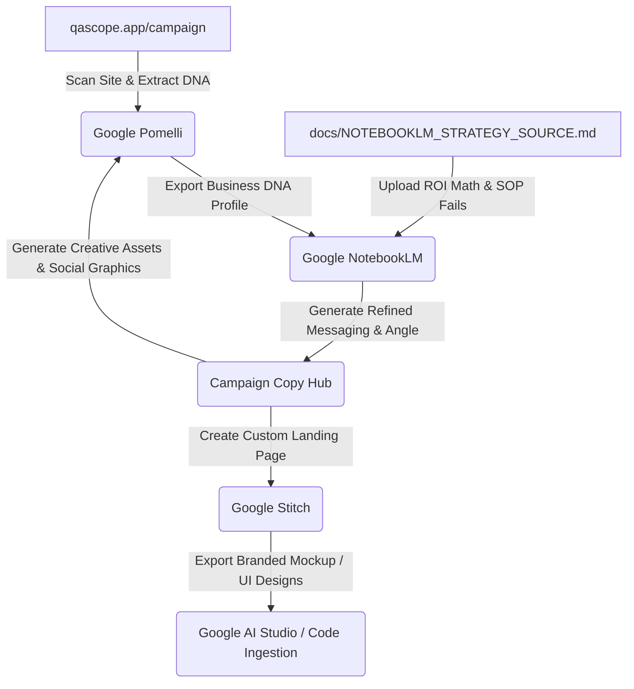

# Google AI Tools Campaign Playbook: QAScope Launch

This playbook describes the end-to-end integration of Google’s suite of experimental AI-powered marketing and productivity tools—**Google Pomelli (Pomelo)**, **Google NotebookLM**, and **Google Stitch**—to run the launch campaign for **QAScope** in India.

The primary strategic theme of this campaign is: **"Audit the Unreviewed 95%."**

---

## The Google AI Tools Marketing Workflow

---

## Step 1: Seeding the Business DNA in Google Pomelli

Google Pomelli is your brand's visual and verbal guardian. By establishing a robust "Business DNA," Pomelli ensures that all generated graphics, social copy, and ad creatives look and sound consistent.

### Workflow:
1. **Host the Campaign Page:** Deploy the new live landing page (`qascope.app/campaign` or `qascope.vercel.app/campaign`) to your production domain.
2. **Scan the Site:** In Pomelli, enter your live URL. Pomelli will scan the website structure, colors, CSS variables, typography, and verbal hooks.
3. **Refine the Business DNA:** 
   - Open [docs/POMELLI_BUSINESS_DNA.md](file:///c:/Users/Bonison%20Vinod/Projects/AI%20QA%20Copilot/qascope/docs/POMELLI_BUSINESS_DNA.md).
   - Manually copy the brand voice, core colors, semantic guidelines, and positioning statements into Pomelli's profile overrides to lock in the identity.
   - This prevents Pomelli from generating generic "AI chatbot" designs, keeping the focus strictly on **"Operator-Built QA Automation."**

---

## Step 2: Strategic Synthesis in Google NotebookLM

Google NotebookLM is your strategic mastermind. By feeding it raw operational data, financial comparisons, competitor documentation, and sales scripts, you convert NotebookLM into an on-demand CMO (Chief Marketing Officer) that understands BPO operations inside and out.

### Workflow:
1. Create a new notebook in **Google NotebookLM** named `"QAScope Launch Campaign Hub"`.
2. Upload the following files as Sources:
   - [docs/NOTEBOOKLM_STRATEGY_SOURCE.md](file:///c:/Users/Bonison%20Vinod/Projects/AI%20QA%20Copilot/qascope/docs/NOTEBOOKLM_STRATEGY_SOURCE.md) (The master strategy, ROI numbers, competitor breakdowns, and compliance checklists).
   - [docs/MARKETING.md](file:///c:/Users/Bonison%20Vinod/Projects/AI%20QA%20Copilot/qascope/docs/MARKETING.md) (The overarching marketing playbook).
   - [docs/OUTBOUND.md](file:///c:/Users/Bonison%20Vinod/Projects/AI%20QA%20Copilot/qascope/docs/OUTBOUND.md) (The daily routine and outreach scripts).
3. **Execute Strategy Prompts:** Use the NotebookLM chat window to query campaign angles. Examples:
   - *"Based on our ROI math, draft a 3-paragraph cold outbound email targeting a Director of Operations running a domestic BFSI campaign in Mumbai."*
   - *"Generate a 5-part LinkedIn carousel outline explaining the financial leakage of a 5% manual QA sampling rate on a 100-agent campaign."*
   - *"What are the key defensive counter-arguments if an enterprise client compares us to Observe.AI on custom integrations?"*

---

## Step 3: Landing Page Prototyping in Google Stitch

Google Stitch is where your verbal campaign strategy transforms into custom visual assets. It allows you to rapidly compose and iterate on landing page user interfaces aligned to your Pomelli Business DNA.

### Workflow:
1. Open **Google Stitch** and load the branding profile exported from **Google Pomelli**.
2. Create a new landing page layout.
3. Open [docs/STITCH_UI_SPEC.md](file:///c:/Users/Bonison%20Vinod/Projects/AI%20QA%20Copilot/qascope/docs/STITCH_UI_SPEC.md) for the exact visual blocks, typography weights, and grid structures.
4. Compose the wireframe using Stitch's drag-and-drop or prompt interface:
   - **Section 1: Hero** (Dark theme, glowing teal border, gradient typography).
   - **Section 2: ROI Interactive Slate** (User input sliders for agents, tickets, and QA salaries).
   - **Section 3: Live Auditing Mockup** (Visual representation of an agent transcript with marked-up compliance fails).
   - **Section 4: Direct Lead Form** (Book a demo button styled with active glow states).
5. **Code Export:** Export the Stitch prototype or feed the generated UI structure into Google AI Studio to inspect the generated layouts and refine them.

---

## Step 4: Asset Generation and Distribution in Pomelli

Once the strategy is synthetically validated in NotebookLM and the landing pages are ready in Stitch, return to Google Pomelli to generate the actual distribution assets.

### Workflow:
1. Open Pomelli's **Asset Generator**.
2. Select your QAScope campaign profile.
3. Open [docs/POMELLI_SOCIAL_PROMPTS.md](file:///c:/Users/Bonison%20Vinod/Projects/AI%20QA%20Copilot/qascope/docs/POMELLI_SOCIAL_PROMPTS.md) and copy the highly-optimized prompt scripts.
4. Generate the following assets:
   - **LinkedIn Text + Banner:** Modern, geometric dark-theme social graphics highlighting: *"Legacy manual QA only reviews a 5% sample. What's hiding in the other 95%?"*
   - **WhatsApp Visual Cards:** Lightweight PNG templates containing the 4-box metric band (100% Coverage, 15-min Setup, ₹0.20/convo cost, 2-tier Review SLA) to send directly to BPO Ops Directors.
   - **Email Header Banners:** Clean brand layouts featuring the QAScope wordmark and the *"Stop Sampling. Start Scoring."* tagline.
5. **Review and Polish:** Verify that Pomelli strictly adheres to your brand color tokens:
   - Accents: **Teal-500** (`#14B8A6`)
   - Surface backgrounds: **Zinc-950** (`#09090B`) / **Zinc-900** (`#18181B`)
   - Text: **Zinc-100** (`#F4F4F5`)

---

## Tracking and Analytics (Metrics to Monitor)

For the "Audit the Unreviewed 95%" campaign, monitor these key parameters:

| Metric | Tool Source | Target | Action If Underperforming |
|---|---|---|---|
| **Landing Page Visitor Bounce Rate** | Analytics | < 45% | Simplify hero copy; ensure loading times under 1.5s |
| **ROI Calculator Interaction Rate** | Custom Events | > 65% | Move calculator higher up the page; make sliders more prominent |
| **Outbound Email Open Rate** | Smartlead.ai | > 55% | Polish the custom subject line to sound less automated |
| **Outbound Email Reply Rate** | Smartlead.ai | > 5% | Hand-personalize the specific LinkedIn signal in sentence 1 |
| **Demo Booking Rate** | Calendly | 2–3 per week | Make the "Book Walkthrough" CTA button larger and sticky |
